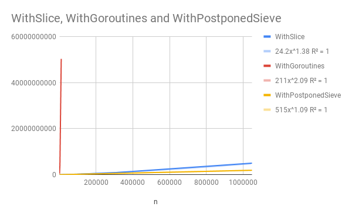

# Generating primes in Go

## Implemented Algorithms

`WithSlice` is a naive implementation of a single-threaded prime-generation
algorithm. Time complexity for generating the first `n` primes: `~O(n^1.38)`.

`WithGoroutines` is an implementation of the Daisy Chain algorithm using Go's
concurrency primitives. Time complexity for generating the first `n` primes:
`~O(n^2.09)`.

`WithPostponedSieve` is an implementation of the Postponed Sieve algorithm.
Time complexity for generating the first `n` primes: `~O(n^1.09)`.

## Algorithms worth implementing

It would be interesting the implement a Postponed Sieve Daisy Chain algorithm
to see how it performs.
